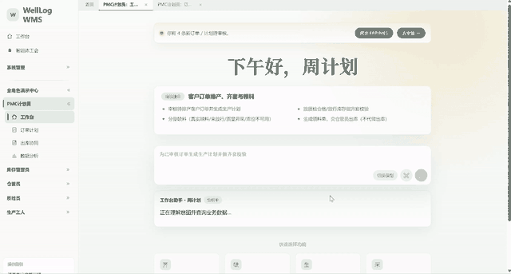

<div align="center">
  <h1>WellLog</h1>
  <p><strong>An Auditable Multi-Agent Platform for Warehouse Operations</strong></p>
  <p>面向制造业仓储流程的可审计多智能体研究原型</p>
  <p>
    <a href="#overview">Overview</a> ·
    <a href="#system-snapshots">Snapshots</a> ·
    <a href="#quick-start">Quick Start</a>
  </p>
</div>



<a id="overview"></a>

## Overview

WellLog 探索如何把大模型的任务规划能力引入仓储管理，同时保留业务系统需要的确定性、权限边界与审计证据。用户用自然语言描述目标；总控智能体生成执行计划，领域智能体在受限数据范围内完成真实业务操作，人工审批与步骤日志贯穿全过程。

项目覆盖收货、质检、入库、出库、库存、盘点和移库等流程，并提供 Vue 工作台、Spring Boot 多智能体内核与独立的视觉质检服务。

## Architecture

WellLog 的运行时由 Workflow Graph、显式 AgentMessage、受权限与幂等约束的 Tool Registry、Supervisor/Verifier 以及领域 Agent 适配层组成。确定性库存操作仍由原有 Service 执行，Agent 负责规划、协同和验证。新的图执行入口为 `POST /agent/platform/task/run`，执行状态、消息轨迹与工具目录分别由 `/agent/platform/execution/{id}`、`/messages` 和 `/agent/platform/tools` 查询。

## System Snapshots

<table>
  <tr>
    <td width="50%" align="center"><br><sub>自然语言任务工作台</sub></td>
    <td width="50%" align="center"><br><sub>智能体能力与组织视图</sub></td>
  </tr>
  <tr>
    <td width="50%" align="center"><br><sub>意图分流与人工确认</sub></td>
    <td width="50%" align="center"><br><sub>步骤级执行监控</sub></td>
  </tr>
  <tr>
    <td width="50%" align="center"><br><sub>出库协同</sub></td>
    <td width="50%" align="center"><br><sub>PDA 三重校验</sub></td>
  </tr>
  <tr>
    <td width="50%" align="center"><br><sub>库存控制</sub></td>
    <td width="50%" align="center"><br><sub>OpenCV + SSIM 视觉质检</sub></td>
  </tr>
  <tr>
    <td width="50%" align="center"><br><sub>运营分析</sub></td>
    <td width="50%" align="center"><br><sub>批次证据链</sub></td>
  </tr>
</table>

## Implementation

| Component | Stack |
| --- | --- |
| Multi-agent backend | Java 17 · Spring Boot 3.5 · MyBatis-Plus |
| Web workbench | Vue 3 · Vite · Element Plus · ECharts |
| Data layer | MySQL 8 · Redis 7 |
| Planning model | DeepSeek-compatible Chat API |
| Visual inspection | FastAPI · OpenCV · SSIM |

<a id="quick-start"></a>

## Quick Start

需要 JDK 17、Node.js 18、MySQL 8 与 Redis 7。先创建 `wms_db`，执行 `src/main/resources/sql/` 中的建表与示例数据脚本，并配置：

```bash
DEEPSEEK_API_KEY=your-key
DB_PASSWORD=your-password
JWT_SECRET=replace-with-a-random-secret-at-least-32-characters
```

启动后端与前端：

```bash
./mvnw spring-boot:run

cd frontend-ai-workbench
npm install
npm run dev
```

前端默认运行于 `http://127.0.0.1:5173`，后端端口为 `8088`。视觉质检服务可选：

```bash
cd light-inspection-service
pip install -r requirements.txt
uvicorn main:app --host 0.0.0.0 --port 8002
```

## Reproducibility

```bash
./mvnw test
cd frontend-ai-workbench && npm run build
```

仓库已包含多智能体编排、权限分流与编号格式化测试，以及用于复现实验流程的示例 SQL。当前实现是研究与教学原型，不建议未经安全审查直接用于生产环境。

## Evaluation

`eval/benchmark/wms-v1/` 提供 WMS-Eval 场景格式，后端 `com.upc.wms.agent.eval` 按最终状态、安全约束和重复运行稳定性评分。建议在同一数据快照上比较规则工作流、单 Agent、中央式多 Agent 与 Supervisor 多 Agent，并报告成功率、状态准确率、安全违规率、时延及 `pass^k`。

## Citation

若本项目对你的研究或课程有帮助，可引用本仓库：

```bibtex
@software{welllog_multi_agent_platform,
  title  = {WellLog: An Auditable Multi-Agent Platform for Warehouse Operations},
  author = {WellLog Contributors},
  year   = {2026},
  url    = {https://github.com/es4er/WellLog}
}
```

## License

本仓库尚未声明开源许可证，默认保留所有权利。第三方依赖遵循各自许可证。
