<div align="center">
  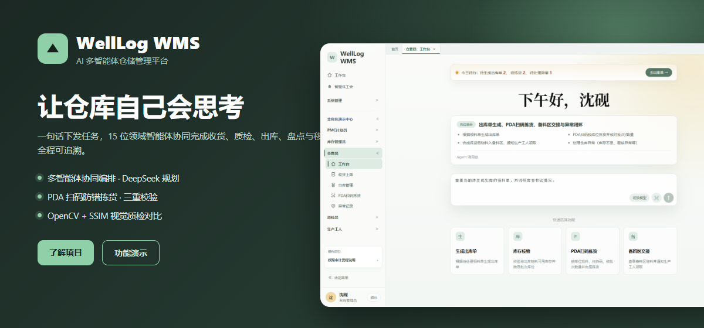
  <p>
    
    
    
    
    
    
    
    
    
    
  </p>
  <p>
    <a href="https://github.com/es4er/wms-agent-platform"><strong>项目仓库</strong></a>
    &nbsp;·&nbsp;
    <a href="#demos"><strong>功能演示</strong></a>
    &nbsp;·&nbsp;
    <a href="#quick-start"><strong>快速开始</strong></a>
    &nbsp;·&nbsp;
    <a href="#agents"><strong>智能体设计</strong></a>
    &nbsp;·&nbsp;
    <a href="https://github.com/es4er/wms-agent-platform/issues"><strong>问题反馈</strong></a>
  </p>
  <p><strong>WellLog WMS：让仓库自己会思考</strong></p>
</div>

**WellLog WMS** 是一套面向制造业仓储场景的 **AI 多智能体仓储管理平台（AI-Native WMS）**。它把仓库日常业务——收货、质检、入库、出库、盘点、移库、补货——交给 **15 位职责清晰的领域智能体** 协同完成：

- 用户只用一句自然语言下达任务，**总控智能体（Orchestrator）** 先借助 DeepSeek 理解目标、识别任务类型并规划执行链；
- 再由领域智能体在**真实数据库**上完成业务校验与写库，并通过能力目录严格约束职责边界；
- 最后由**审计智能体**收尾，产出可回溯的步骤日志与 AI 分析报告。

前端提供覆盖 **计划（PMC）/ 仓管 / 质检 / 工人 / 系统管理员** 五类角色的工作台，支持自然语言下发任务、PDA 扫码防错拣货，以及基于 **OpenCV + SSIM** 的轻量视觉质检对比服务。

> 设计原则：**规划由模型负责，业务判断与写库由领域 Agent 基于真实数据负责**。DeepSeek 不直接修改业务单据。

## News

- **[2026.07]** 🚀 WellLog WMS 完成多智能体编排主线：DeepSeek 任务理解 + 能力目录调度 + 领域 Agent 真链执行 + Agent 监控台可视化。
- **[2026.07]** 📦 开源 Spring Boot 后端、Vue 3 前端工作台与 FastAPI 视觉质检服务三端代码。
- **[2026.07]** 📝 上线覆盖 5 类角色的演示数据（PMC / 仓库 / 库存 / 质检 / 工人）。

<a id="demos"></a>

## Demos

从自然语言任务到跨智能体协作，覆盖收货、质检、出库、盘点四大核心链路。

<table>
  <tr>
    <td width="33%" align="center" valign="top"><a href="assets/demo-workbench.png">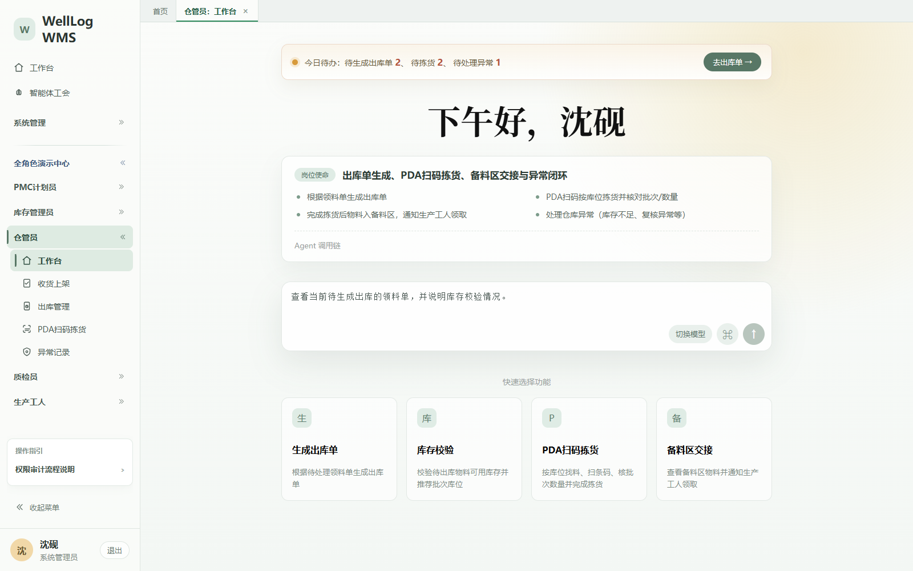</a><br><strong>全角色 AI 工作台</strong><br><sub>一句话下发任务，自动判别意图与待办</sub></td>
    <td width="33%" align="center" valign="top"><a href="assets/demo-agent-union.png">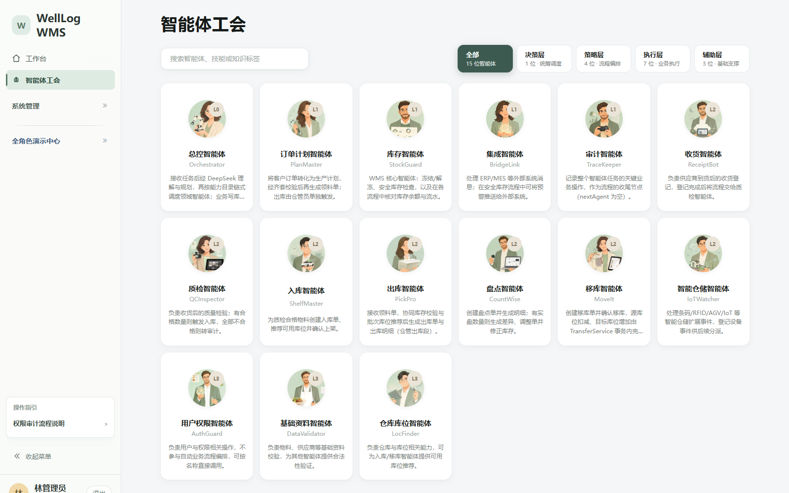</a><br><strong>智能体工会</strong><br><sub>15 位智能体 · 四层协同 · 技能与知识标签</sub></td>
    <td width="33%" align="center" valign="top"><a href="assets/demo-outbound.png">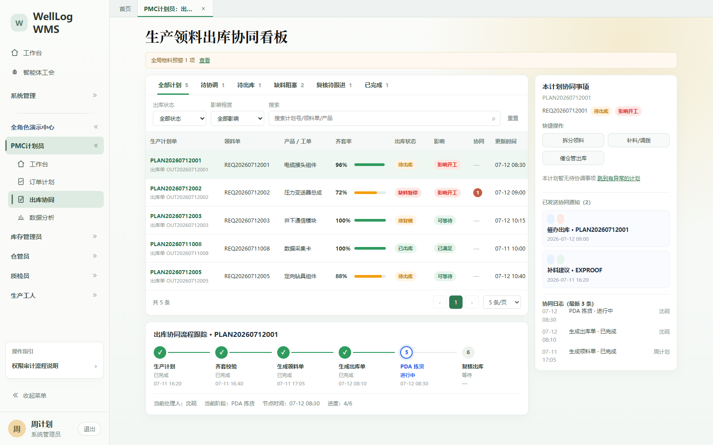</a><br><strong>出库协同看板</strong><br><sub>按可用库存自动推荐 FIFO 批次与库位</sub></td>
  </tr>
  <tr>
    <td width="33%" align="center" valign="top"><a href="assets/demo-pda-scan.png">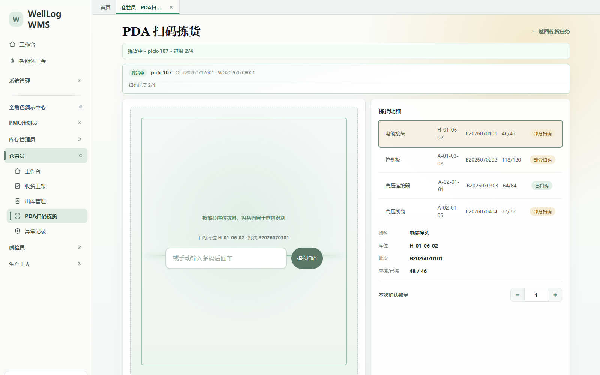</a><br><strong>PDA 扫码拣货</strong><br><sub>库位 / 物料 / 批次三重校验防错拣</sub></td>
    <td width="33%" align="center" valign="top"><a href="assets/demo-inventory-control.png">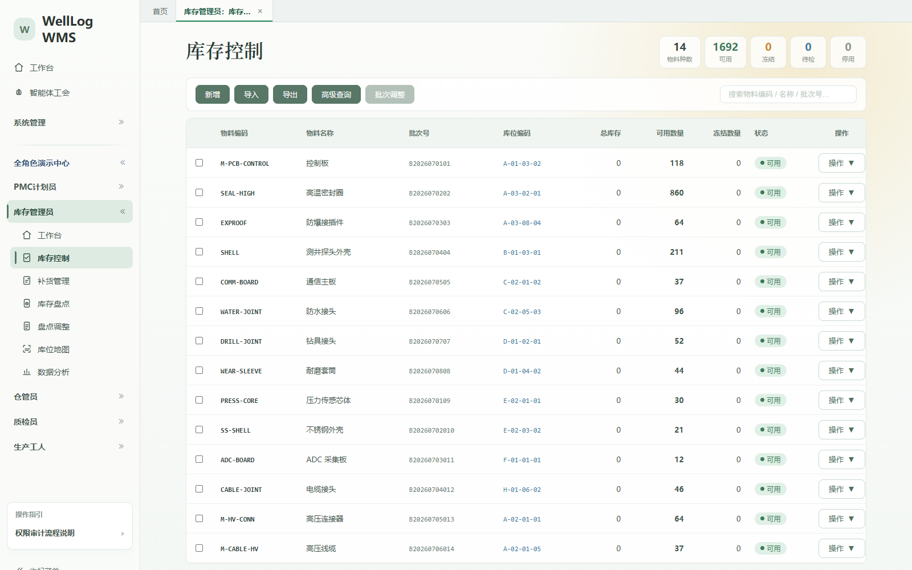</a><br><strong>库存控制</strong><br><sub>多批次库位与可用量一览，盘点差异自动比对</sub></td>
    <td width="33%" align="center" valign="top"><a href="assets/demo-quality-compare.png">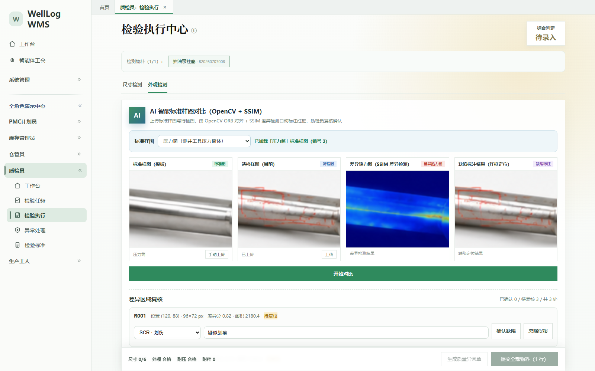</a><br><strong>视觉质检对比</strong><br><sub>OpenCV + SSIM 圈出差异并输出热力图</sub></td>
  </tr>
</table>

## AI Workbench / 协同监控台

我们把「Agent 是怎么干活的」也做成了可观察、可干预的产品界面：任务下发后可以看到意图分流、执行时间线与步骤级日志，并支持人工确认与审计追溯。

<table>
  <tr>
    <td width="50%" align="center">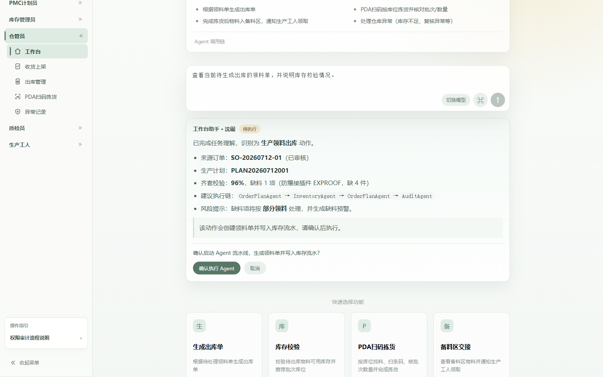<br><strong>AI 助手 · 意图分流</strong><br><sub>问答直接回答，动作需人工确认后才编排 Agent</sub></td>
    <td width="50%" align="center">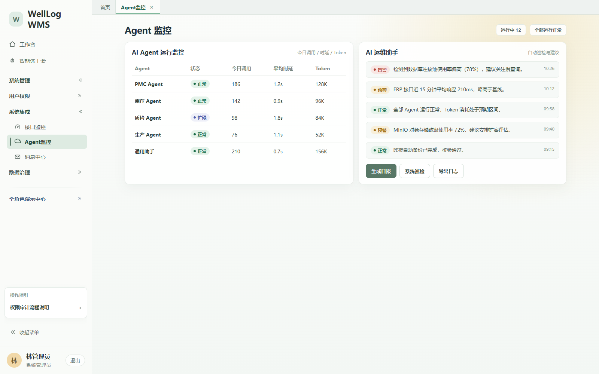<br><strong>Agent 任务监控</strong><br><sub>步骤级执行日志与 AI 分析报告全程可回溯</sub></td>
  </tr>
  <tr>
    <td width="50%" align="center">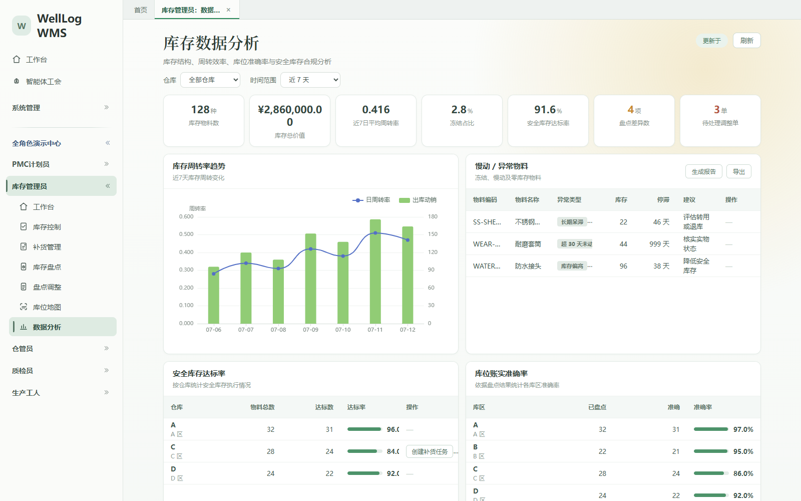<br><strong>数据分析</strong><br><sub>出库及时率、库存周转、拣货准确率等经营指标</sub></td>
    <td width="50%" align="center">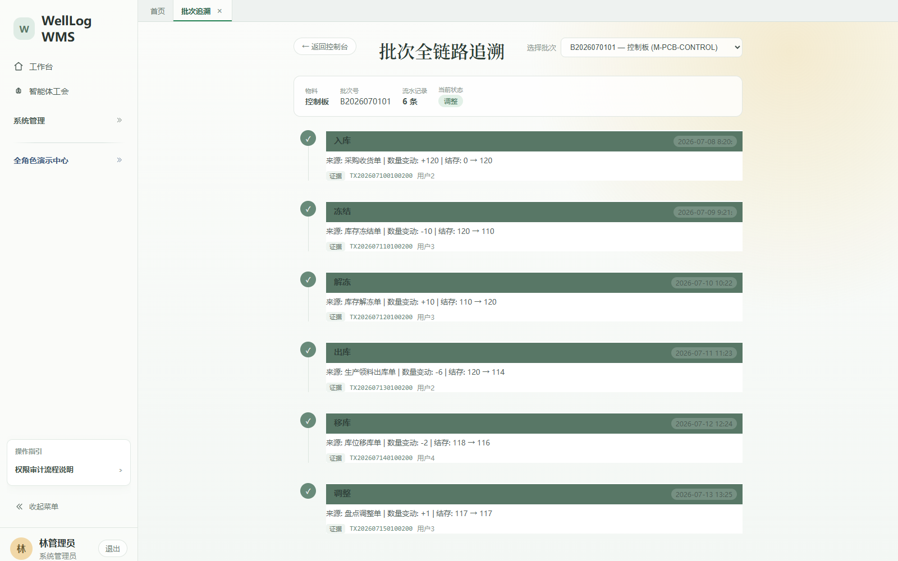<br><strong>批次追溯</strong><br><sub>一个批次从入库到出库的全链路证据链</sub></td>
  </tr>
</table>

## 核心能力

- 🧠 **自然语言任务编排** —— 用一句话描述目标，Orchestrator 调用 DeepSeek 完成任务理解、任务类型识别与执行链规划，模型不可用时自动回退到规则链路。
- 🤝 **多智能体真链协作** —— 每个领域 Agent 独立持有能力、数据范围与返回格式契约，按能力目录被调度，避免「一个提示词干所有事」。
- 🔐 **意图分流与权限边界** —— 助手先判定「问答 / 待执行 / 需补充 / 无权限」，越权请求直接拒绝，写操作必须人工确认。
- 📦 **库存一致性保障** —— 齐套校验仅统计「已入库 + 质检合格/放行 + 未冻结 + 可用 > 0」的库存，并输出缺料、质量未放行、质量异常、库位不可用四类分型。
- 📱 **PDA 扫码防错** —— 库位、物料、批次三重校验，拣货过程实时生成库存流水。
- 👁️ **轻量视觉质检** —— Python FastAPI 服务基于 OpenCV + SSIM 对标准样图与待检图做差异检测，返回差异区域坐标、掩膜与热力图。
- 🧾 **全链路追溯与审计** —— Agent 任务步骤、执行日志、库存流水、批次流转全程留痕，支持证据追溯与 AI 复盘报告。

<a id="agents"></a>

## 智能体设计

平台采用 **四层智能体架构**，共 15 位智能体。总控负责编排，领域智能体负责执行，辅助智能体按需被调用。

| 层级 | 智能体 | 代号 | 职责 |
| --- | --- | --- | --- |
| 决策层 L0 | 总控智能体 | `WmsAgentOrchestrator` | 任务理解、类型识别、执行链规划与调度 |
| 策略层 L1 | 订单计划智能体 | `OrderPlanAgent` | 客户订单 → 生产计划 → 齐套 → 领料单 |
| 策略层 L1 | 库存智能体 | `InventoryAgent` | 冻结/解冻、安全库存检查、库存核对与流水 |
| 策略层 L1 | 集成智能体 | `IntegrationAgent` | ERP / MES 消息集成与同步 |
| 策略层 L1 | 审计智能体 | `AuditAgent` | 全部流程的收尾审计与结论归档 |
| 执行层 L2 | 收货智能体 | `ReceivingAgent` | 供应商到货收货与上架准备 |
| 执行层 L2 | 质检智能体 | `QualityAgent` | 到货质量检验与放行判定 |
| 执行层 L2 | 入库智能体 | `InboundAgent` | 入库上架与库位推荐 |
| 执行层 L2 | 出库智能体 | `OutboundAgent` | 领料出库、拣货与复核 |
| 执行层 L2 | 盘点智能体 | `StocktakeAgent` | 盘点差异分析与调整单生成 |
| 执行层 L2 | 移库智能体 | `TransferAgent` | 库位移库执行 |
| 执行层 L2 | 智能仓储智能体 | `SmartWarehouseAgent` | IoT / AGV / RFID 事件处理 |
| 辅助层 L3 | 用户权限智能体 | `UserAgent` | 用户、角色与权限管理 |
| 辅助层 L3 | 基础资料智能体 | `MasterDataAgent` | 物料与供应商基础资料校验 |
| 辅助层 L3 | 仓库库位智能体 | `WarehouseAgent` | 仓库与库位管理 |

## 系统架构

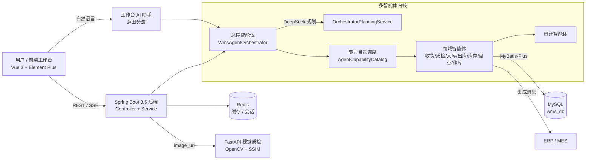

后端基于 **Spring Boot 3.5 + MyBatis-Plus**，通过能力目录把「谁负责什么、能看哪些数据、返回什么结构」固化成契约；前端 **Vue 3 + Vite** 提供五类角色工作台；质检链路下沉到独立的 **Python FastAPI** 服务，主服务只做编排与结果落库。

<a id="quick-start"></a>

## 快速开始

### 环境要求

| 组件 | 版本 / 说明 |
| --- | --- |
| JDK | 17+ |
| Maven | 使用仓库内置 `mvnw` 即可 |
| Node.js | 18+ |
| MySQL | 8.x，库名 `wms_db` |
| Redis | 7.x，默认 `localhost:6379` |
| Python | 3.10+（仅视觉质检服务需要） |
| DeepSeek API Key | 用于任务理解与 AI 分析，缺失时自动回退规则链路 |

### 1. 配置环境变量

复制 `.env.example`，按需填写：

```bash
DEEPSEEK_API_KEY=your-deepseek-api-key
DB_PASSWORD=your-mysql-password
JWT_SECRET=replace-with-a-random-secret-at-least-32-characters
```

### 2. 初始化数据库

在 MySQL 中创建 `wms_db`，并执行 `src/main/resources/sql/` 下的建表与种子脚本（建议按文件名顺序执行，`agent_tables.sql`、`quality_inspect_master.sql`、各 `*_seed.sql` 等）。

### 3. 启动后端（端口 8088）

```bash
./mvnw spring-boot:run
```

### 4. 启动前端工作台

```bash
cd frontend-ai-workbench
npm install
npm run dev
```

浏览器打开终端输出的地址（默认 `http://127.0.0.1:5173`）即可进入工作台。

### 5. 启动视觉质检服务（可选，端口 8002）

```bash
cd light-inspection-service
pip install -r requirements.txt
uvicorn main:app --host 0.0.0.0 --port 8002
```

健康检查：`GET http://localhost:8002/health`。

## 技术栈

| 分层 | 技术选型 |
| --- | --- |
| 后端框架 | Java 17 · Spring Boot 3.5 · Spring Web / WebFlux(SSE) |
| 持久层 | MyBatis-Plus 3.5 · MySQL 8 · 逻辑删除与乐观锁 |
| 缓存 / 会话 | Redis 7 · Spring Data Redis · Lettuce 连接池 |
| 鉴权 | JWT（JJWT）· 图片验证码（Hutool） |
| 大模型 | DeepSeek Chat API（任务理解、执行链规划、AI 分析） |
| 接口文档 | springdoc-openapi（Swagger UI） |
| 文件与报表 | EasyExcel · OkHttp |
| 前端 | Vue 3 · Vite 5 · Vue Router · Element Plus · ECharts · xlsx · marked |
| 质检服务 | Python · FastAPI · OpenCV · scikit-image · NumPy（SSIM） |
| 工程化 | Maven Wrapper · npm |

## Roadmap

- [x] 发布多智能体编排内核（DeepSeek 规划 + 能力目录调度）
- [x] 打通收货 → 质检 → 入库 / 出库 → 盘点 → 移库主链路
- [x] 上线智能体工会与 Agent 任务监控台
- [x] 集成 OpenCV + SSIM 轻量视觉质检服务
- [ ] 增加智能体执行链的可视化编排与人工干预节点
- [ ] 接入更多大模型供应商（OpenAI / Qwen / 本地模型）
- [ ] 补充 Docker Compose 一键部署与 CI 流水线
- [ ] 完善单元测试与端到端测试覆盖

## 致谢

感谢以下开源项目为 WellLog WMS 提供基础设施与灵感：

- [Spring Boot](https://github.com/spring-projects/spring-boot) —— 后端应用框架。
- [MyBatis-Plus](https://github.com/baomidou/mybatis-plus) —— 持久层增强。
- [Vue.js](https://github.com/vuejs/core) 与 [Element Plus](https://github.com/element-plus/element-plus) —— 前端工作台。
- [FastAPI](https://github.com/fastapi/fastapi) 与 [OpenCV](https://github.com/opencv/opencv) —— 轻量视觉质检服务。
- [DeepSeek](https://www.deepseek.com/) —— 任务理解与执行链规划的大模型能力。

## License

本项目目前**未声明开源许可证**，默认保留所有权利（All Rights Reserved）。

- 本项目主要用于学习、教学与技术交流；
- 如需商用、二次分发或基于本项目构建衍生作品，请先联系作者获得授权；
- 仓库中的第三方依赖遵循其各自的许可证。

如希望以开源许可证发布，可在仓库根目录添加 `LICENSE` 文件（例如 MIT / Apache-2.0），并同步更新本节的说明。

---

<div align="center">
  <sub>Made with ❤️ for warehouse automation · WellLog WMS</sub>
</div>
